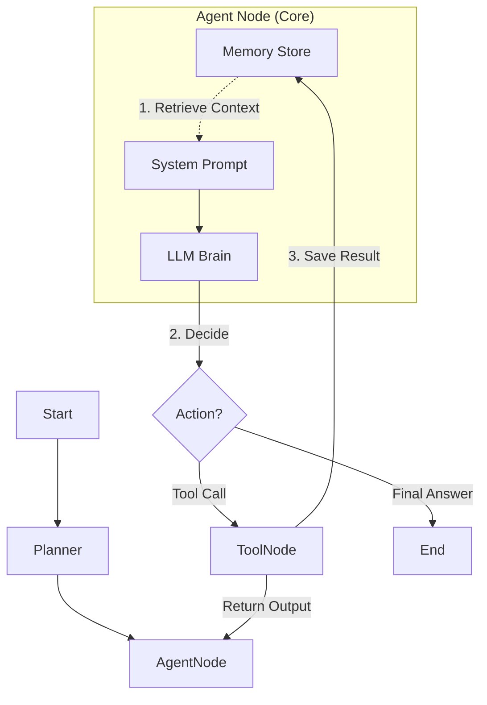

toolName: todo_write
            
status: success
          
Todos updated: 3 items
          

        
            
toolName: view_files
            
status: success
          
            
filePath: e:\Research_Agent\research_agent\core.py
          

        
            
toolName: view_files
            
status: success
          
            
filePath: e:\Research_Agent\research_agent\planner.py
          

        
            
toolName: view_files
            
status: success
          
            
filePath: e:\Research_Agent\research_agent\state.py
          

        
            
toolName: view_files
            
status: success
          
            
filePath: e:\Research_Agent\research_agent\core.py
          
基于您对 Agent 工作流程“纯粹、高效”且保留 LangGraph 和 Plan React 模式的要求，我为您制定了以下重构方案。

### 核心目标
**移除**所有硬编码的“强制干预”逻辑（如外部强制反思、强制策略切换、复杂的后处理拦截），将决策权**完全归还给 Agent**（LLM），利用 LangGraph 构建一个标准的 **Plan -> ReAct Loop** 架构。

---

### 1. 模块清理 (Module Cleanup)
为了实现“纯粹”，我们将移除以下“不必要的组件模块”，它们包含了过多的人工规则和后处理逻辑：

*   🗑️ **`enhancer.py` (AgentEnhancer)**: 移除。不再需要外部强制合成答案或拦截结果。
*   🗑️ **`constraint_analyzer.py`**: 移除。不再进行预设的约束分析，改为 Agent 动态分析。
*   🗑️ **`lateral_breakout.py`**: 移除。不再由代码检测死循环并强制生成关键词，改为 System Prompt 指导 Agent 自主变通。
*   🗑️ **`validator.py`**: 移除。不再使用硬编码规则校验 Plan。
*   🗑️ **`verification.py`**: 移除复杂的验证链逻辑，验证动作内化为 Agent 的思考步骤。
*   🗑️ **`complexity.py`**: 移除。步数由 Graph 统一控制，不再动态计算。
*   🗑️ **`entity_graph.py`**: 移除（如果存在）。

**保留的核心模块**：
*   `agent.py`: 入口。
*   `core.py`: 重构为 LangGraph 定义文件。
*   `planner.py`: 简化为仅提供 Prompt 模板或简单的 Plan 生成函数。
*   `search.py` / `skills/`: 保留所有工具能力。

---

### 2. 新架构设计 (New Architecture)

我们将基于 **LangGraph** 重构 `core.py`，构建一个清晰的 StateGraph。

#### **State 定义**
```python
class AgentState(TypedDict):
    messages: Annotated[List[BaseMessage], add_messages] # 消息历史
    plan: str                                            # 当前的任务/计划
    steps: int                                           # 当前步数
```

#### **Graph 结构**
`START` -> **`planner`** -> **`agent`** <==> **`tools`** -> `END`

*   **Node 1: `planner` (Plan)**
    *   **功能**: 在任务开始时，生成一个初始的思维导图或步骤计划。
    *   **输出**: 更新 State 中的 `plan` 字段，并将其作为 System Message 注入 context。
    *   **逻辑**: 仅执行一次，为 Agent 设定初始方向。

*   **Node 2: `agent` (Dynamic Thinking / ReAct)**
    *   **功能**: 核心思考节点。接收 `messages` 和 `plan`。
    *   **自主策略**:
        *   调用 LLM。
        *   LLM 根据 System Prompt 决定是调用工具 (`tools`) 还是输出最终答案 (`Final Answer`)。
        *   **自主判断逻辑**（通过 Prompt 实现）：
            *   *Found Answer* -> 直接生成文本，Graph 结束。
            *   *Blocked* -> LLM 在 Thought 中自我反思 ("此路不通，尝试关键词 B")，生成新的 Tool Call。
            *   *Insufficient* -> 继续调用 Tool。

*   **Node 3: `tools` (Execute)**
    *   **功能**: 执行 Tool Calls (Search, Read, etc.)。
    *   **输出**: ToolOutput Message，返回给 `agent` 节点。

#### **Edges (流转逻辑)**
1.  `planner` -> `agent`
2.  `agent` -> `tools` (当检测到 tool_calls 时)
3.  `agent` -> `END` (当没有 tool_calls 或输出 Final Answer 时)
4.  `tools` -> `agent` (循环)

---

### 3. System Prompt 重构策略
这是实现“自主性”的关键。我们将移除 Python 代码中的 `if dead_end: force_switch()`，改为在 System Prompt 中植入**动态思考元指令**：

```markdown
You are an autonomous research agent. 
Goal: {user_task}
Current Plan: {plan}

### Dynamic Strategy Instructions
1. **Execution**: Follow the plan, but be flexible.
2. **Self-Correction**: 
   - If a search yields no results, DO NOT retry the same query. 
   - IMMEDIATELY switch strategy (e.g., search for a broader category, or a related entity).
   - YOU decide when to pivot.
3. **Completion**: 
   - Once you have sufficient information (>=2 sources), output the "Final Answer" immediately.
   - Do not over-verify if the answer is clear.
```

### 4. 预期效果
1.  **代码量大幅减少**: 移除了复杂的辅助类，代码更易维护。
2.  **决策更流畅**: 避免了 Python 代码强行插入 System Message 导致的上下文割裂。
3.  **LangGraph 原生**: 利用 Graph 的循环机制自然处理多步任务，状态管理更清晰。


### 记忆模块现状分析与优化方案

根据您的要求，我深入分析了 [memory.py](file:///e:/Research_Agent/research_agent/memory.py) 的代码以及它在新架构（LangGraph + 纯粹 Agent）中的定位。

#### 1. 现状评估 (Current Status)
目前的 `MemoryStore` 是一个**基于关键词 (BM25) 的轻量级本地记忆系统**。

*   **优点 (保留)**：
    *   **零依赖**：不依赖向量数据库，纯 Python 实现，部署简单。
    *   **中文优化**：内置了 Jieba 分词和 fallback 规则，对中文查询支持较好。
    *   **时间感知**：具备 `time_boost` 和 `age_days` 逻辑，优先召回最近的记忆，这对于连续对话非常重要。
    *   **自动修剪**：有 LRU 风格的 `_prune_old_memories`，防止上下文无限膨胀。
*   **不足 (优化)**：
    *   **被动注入**：目前是在 `core.py` 中硬编码“搜索 Top-4 -> 插入 Prompt”。这导致 Agent 无法主动决定何时查阅记忆。
    *   **缺乏结构化**：记忆仅是文本片段（Short/Long），缺乏对“实体”或“规则”的显式区分（虽然 User Prompt 中有 Core Memory 定义，但底层存储是扁平的）。

#### 2. 在新架构 (LangGraph) 中的集成方案

为了保持 Agent 的**纯粹性**和**高效性**，建议将 Memory 模块从“硬编码的预处理步骤”转变为“**State 感知的上下文增强层**”。

在 LangGraph 的 Loop 中，Memory 将扮演两个角色：

1.  **Context Injector (上下文注入者)**：在 Agent 思考之前，自动提供相关背景。
2.  **Experience Recorder (经验记录者)**：在 Tool 执行后，自动记录关键产出。

**重构后的数据流向图**：



#### 3. 具体优化建议 (Optimization Plan)

我们不需要重写 `memory.py` 的核心逻辑，而是优化它的**使用方式**：

**A. 增强 Prompt 注入 (Context Injection)**
不再简单地插入文本，而是将记忆分为两类注入 System Prompt，减少 Token 浪费：
*   **Relevant Facts**: 通过 `search(query)` 召回的与当前任务强相关的事实。
*   **Recent History**: 最近 N 步的交互摘要（Short-term memory）。

**B. 赋予 Agent 主动权 (Tool-based Memory)**
除了被动注入，建议新增一个 **`recall_memory` Skill**。
*   **场景**：当 Agent 发现当前信息不足，或者觉得这个问题以前处理过时。
*   **动作**：Agent 可以主动调用 `recall_memory(query="previous research on X")`。
*   **价值**：符合“自主判断”的原则——Agent 觉得需要回忆时才回忆，而不是每次都塞一堆 Token。

**C. 简化接口 (Code Simplification)**
在 `core.py` 重构时，将 Memory 操作封装在 Node 内部，保持 Graph 清晰：

```python
# 伪代码预览
def agent_node(state: AgentState):
    # 1. 自动召回：基于当前 Plan/Query 检索 Memory
    memories = memory_store.search(state["query"])
    
    # 2. 构造 Prompt：包含 Plan + Memories
    prompt = build_prompt(state["plan"], memories)
    
    # 3. LLM 决策
    response = llm.invoke(prompt)
    return {"messages": [response]}
```

#### 4. 结论
*   **保留**：完全保留 `memory.py` 文件，不需要删除或重写其底层算法。
*   **优化**：在 `core.py` 重构时，改变调用它的方式。
    1.  **自动检索**：保留作为 System Prompt 的一部分。
    2.  **工具化**：(可选) 包装成 Tool 供 Agent 主动调用。
    3.  **持久化**：在 Graph 结束节点 (`END`) 统一触发 `save()`。
