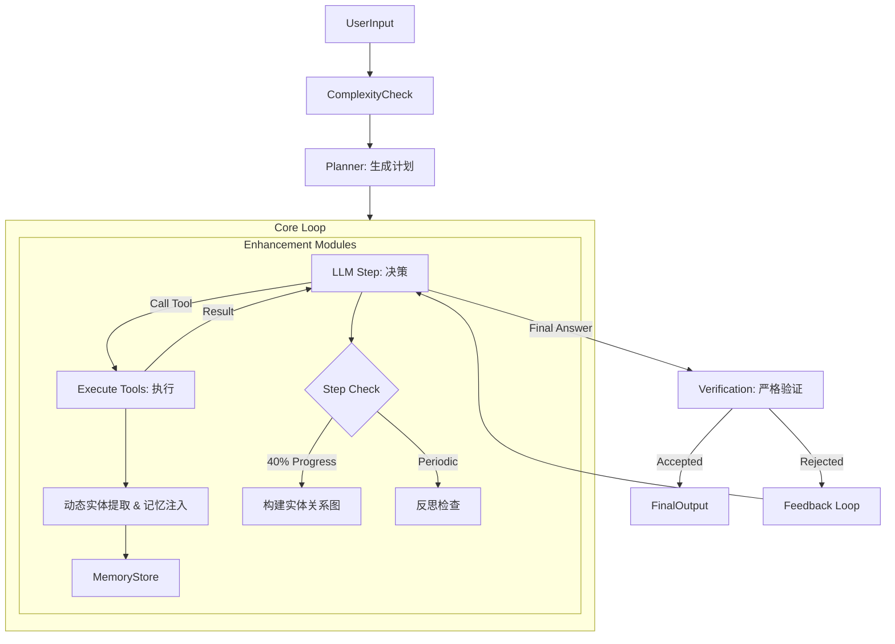

基于当前的 codebase（特别是 `core.py`, `enhancer.py` 以及各个 Skills），Agent 处理复杂问题的工作流程是一个**基于状态机（State Graph）的闭环迭代系统**。

整个系统由 **LangGraph** 驱动，核心在于“规划-执行-反思-修正”的循环。

以下是各模块的详细协调流程说明：

### 1. 启动与规划阶段 (Initialization & Planning)
在正式搜索之前，Agent 会先进行“战略部署”。

*   **复杂度评估 (`complexity.py`)**：
    *   系统首先分析问题的长度、约束条件数量，动态计算 `max_steps`（通常 20-45 步）。这决定了 Agent 有多少“预算”来解决问题。
*   **Planner (`agent_loop` in `core.py`)**：
    *   在进入循环前，一个专门的 LLM 角色（Planner）会分析用户问题。
    *   **产出**：生成一份分步骤的 `Plan`，明确指出“Hard Constraints”（硬约束，如时间、地点）和“Soft Constraints”（软约束）。
    *   **强制引导**：如果问题复杂，Planner 会强制要求第一步使用 `smart-search` Skill，并将 Plan 注入到 System Prompt 中，作为 Agent 的最高指令。

### 2. 核心循环阶段 (The Core Loop)
这是 Agent 的“主战场”，主要由 `llm_step` 和 `execute_tools` 两个节点交替运行。

*   **决策大脑 (`llm_step` in `core.py`)**：
    *   Agent (LLM) 根据当前的对话历史（Messages）和 Plan，决定下一步行动。
    *   它会选择调用工具（如 `smart-search`, `web_fetch`）或者在收集足够信息后输出 `Final Answer`。
*   **执行手脚 (`execute_tools` in `core.py`)**：
    *   执行 LLM 选择的工具。这里集成了我们刚才优化的逻辑：
        *   **Smart Search**: 不仅仅是搜索，它会进行关键词扩展、多语言转换。
        *   **Web Fetch & Summary**: 如果抓取内容过长，会调用 LLM 生成**摘要 (Fact Summary)**，替换掉原始的长文本（*这是刚才针对噪音问题的关键优化*）。

### 3. 动态感知与记忆 (Dynamic Perception)
在工具执行过程中，几个“后台进程”在默默工作，增强 Agent 的感知能力。

*   **动态实体提取 (`DynamicRetrieval` in `core.py` & `processors.py`)**：
    *   每次工具返回结果后，系统会自动扫描文本，提取新的“核心实体”（如新出现的人名、事件）。
    *   **去噪机制**：使用我们刚才改进的逻辑，过滤掉 `source`, `title` 等元数据噪音。
    *   **记忆注入**：如果新实体在 `MemoryStore`（长期记忆）中有记录，系统会立即将相关历史记忆注入到当前 Context 中，防止 Agent 重复劳动。

### 4. 元认知与反思 (Metacognition & Reflection)
为了防止 Agent“钻牛角尖”或“迷路”，`AgentEnhancer` 模块起到了监督作用。

*   **反思检查点 (`ReflectionManager`)**：
    *   每隔一定步数（或检测到循环时），系统会强制插入一段 `System Message`，询问 Agent：“你是否在原地打转？你是否满足了所有约束？”
*   **实体关系图构建 (`EntityGraph` in `enhancer.py`)**：
    *   在任务进行到约 40% 进度时，系统会触发一次深度分析，构建当前已知信息的“实体关系图”。
    *   **查漏补缺**：如果发现关系图中缺少关键节点（例如知道了“地点”但不知道“成立年份”），会主动生成 Targeted Queries（针对性查询）引导 Agent 搜索。

### 5. 收敛与验证 (Synthesis & Verification)
当 Agent 认为找到了答案，或步数耗尽时，进入终局阶段。

*   **答案合成 (`synthesize_answer`)**：
    *   如果 Agent 此时仍未输出答案（例如步数耗尽），Enhancer 会强制从所有历史搜索结果中提取候选答案（Candidate Extraction）并进行逻辑合成。
*   **严格验证 (`verification.py`)**：
    *   这是最后的守门员。Agent 生成的 `Final Answer` 会被送入验证模块。
    *   **双重检查**：根据我们刚才的修改，重点检查：
        1.  **语言一致性**（中文问中文答）。
        2.  **实体类型匹配**（问年份必须答年份）。
    *   **拒绝与修正**：如果验证失败，系统会拒绝该答案，并将“拒绝理由”作为 Feedback 发回给 Agent，强制其进行下一轮修正（Self-Correction）。

---

### 模块协作图解

### 关键代码索引
*   **主循环控制**: [core.py](file:///e:\Research_Agent\research_agent\core.py)
*   **增强器协调**: [enhancer.py](file:///e:\Research_Agent\research_agent\enhancer.py)
*   **验证逻辑**: [verification.py](file:///e:\Research_Agent\research_agent\verification.py)
*   **实体处理**: [processors.py](file:///e:\Research_Agent\research_agent\processors.py)